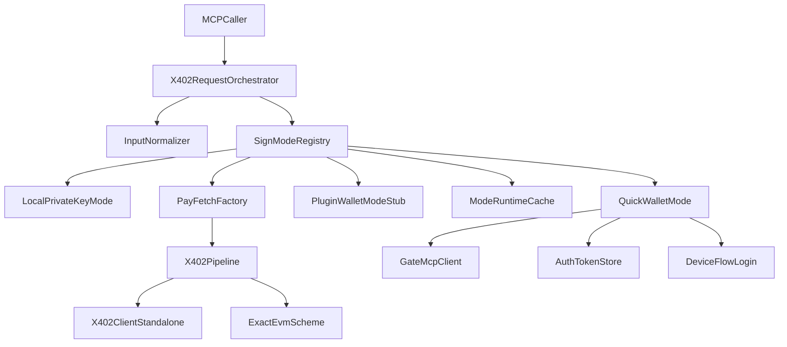
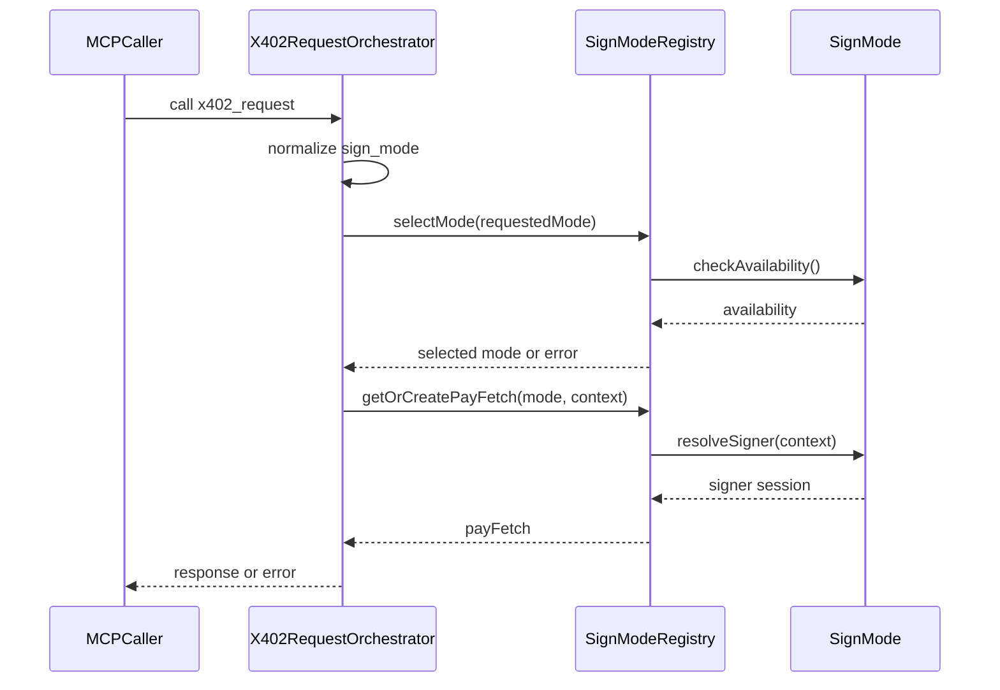
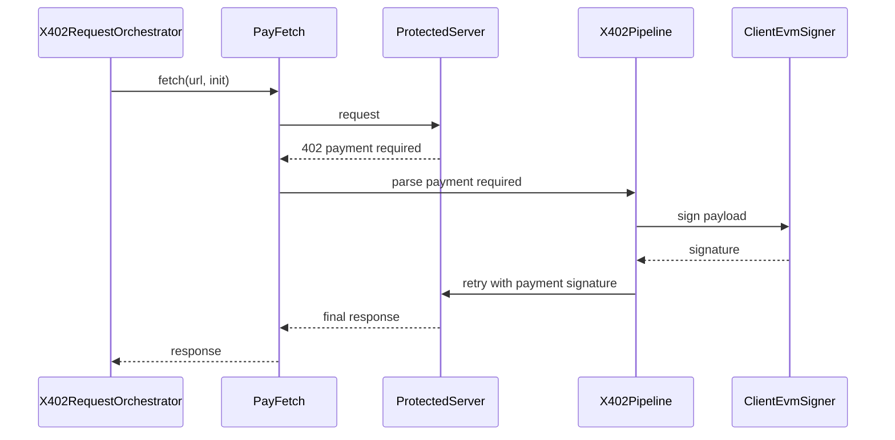

# Design Document

## Overview

本次设计将 `x402_request` 从“入口文件内硬编码两种签名分支”的结构，重构为“入口编排 + `sign_mode` 注册中心 + 各 mode 独立领域模块 + 通用 x402 支付管线”的分层架构。目标是在不改变现有 `402 -> 解析 -> 签名 -> 重试` 主流程的前提下，把模式选择、配置检查、登录补全、signer 构建与缓存管理抽离出来，使新增插件钱包或其他远程签名模式时无需继续膨胀 `src/index.ts`。

该设计面向两类用户：一类是 MCP 调用方，他们需要通过统一的 `sign_mode` 参数获得稳定且可预测的签名行为；另一类是维护者，他们需要用独立目录承载不同 mode 的认证与签名逻辑，并通过清晰接口快速接入新模式。本次改造延续 quick wallet 在缺少 token 时可触发 device flow 登录的现有能力，同时统一要求调用方使用 `sign_mode`。

### Goals
- 统一 `x402_request` 的 `sign_mode` 调用模型。
- 在请求真正发出前完成 mode 可用性检查、自动选模和显式模式校验。
- 将本地私钥模式和 quick wallet 模式拆分为独立领域模块。
- 复用现有 `x402-standalone` 支付主流程，避免重复实现签名与重试逻辑。
- 引入统一缓存与并发控制，避免重复初始化和重复登录。

### Non-Goals
- 本次不新增新的对外 MCP Tool。
- 本次不改写 `ExactEvmScheme` 的支付协议语义。
- 本次不实现完整的 plugin wallet 真正接入，只预留模式边界。
- 本次不引入新的第三方依赖或路径别名体系。

## Requirements Traceability

| Requirement | Summary | Components | Interfaces | Flows |
|-------------|---------|------------|------------|-------|
| 1.1-1.5 | 统一 `sign_mode` 输入 | `X402RequestOrchestrator`, `InputNormalizer` | `NormalizedRequest`, `SignModeId` | 模式解析与选择流程 |
| 2.1-2.5 | 请求前完成 mode 可用性检查与自动选模 | `SignModeRegistry`, `ModeAvailabilityProbe` | `SignModeAvailability`, `SelectionResult` | 模式解析与选择流程 |
| 3.1-3.5 | 显式模式前置校验与模式专属提示 | `SignModeRegistry`, `QuickWalletMode`, `LocalPrivateKeyMode` | `SignModeError`, `ResolveSignerContext` | 模式解析与选择流程 |
| 4.1-4.5 | mode 可插拔架构与清晰目录边界 | `SignModeRegistry`, `SignModeDefinition`, 各 mode 模块 | `SignModeDefinition` | 架构边界图 |
| 5.1-5.5 | 通用 x402 签名与重试管线 | `PayFetchFactory`, `X402ClientStandalone`, `ExactEvmScheme` | `ResolvedSignerSession`, `ClientEvmSigner` | 支付执行流程 |
| 6.1-6.5 | 缓存、并发安全、类型与测试 | `SignModeRegistry`, `ModeRuntimeCache`, 测试套件 | `ModeCacheKey`, `ModeInitState` | 模式初始化流程 |

## Architecture

### Existing Architecture Analysis

当前架构中，`src/index.ts` 同时负责：
- MCP tool schema 与请求参数解析
- `sign_mode` 分支判断
- 环境变量与 token 检查
- quick wallet 登录补全
- signer 创建
- `X402ClientStandalone` 与 `wrapFetchWithPayment()` 的装配
- 按模式缓存 `payFetch`

这种实现已经满足本地私钥和 quick wallet 两条路径，但对新增模式不友好。每加入一种 mode，都需要在入口文件追加参数枚举、可用性判断、初始化逻辑和缓存分支，违背 steering 中“入口层只做编排，不承载可复用协议细节”的原则。

### Architecture Pattern & Boundary Map



**Architecture Integration**:
- Selected pattern: 策略注册模式。每个 `sign_mode` 以统一接口注册到 registry，由 registry 负责选择、缓存和生命周期控制。
- Domain boundaries: 入口层负责请求编排；mode 层负责可用性检查与 signer 准备；x402 核心层负责支付协议执行；钱包适配层只服务对应 mode。
- Existing patterns preserved: 继续复用 `ClientEvmSigner`、`ExactEvmScheme`、`wrapFetchWithPayment()`、`X402ClientStandalone`。
- New components rationale: registry 负责集中管理模式；factory 负责抽取通用装配；cache 负责并发与复用控制。
- Steering compliance: 入口层瘦身、目录边界清晰、外部交互逻辑停留在 mode 或 wallet 适配层。

### Technology Stack

| Layer | Choice / Version | Role in Feature | Notes |
|-------|------------------|-----------------|-------|
| MCP Server | `@modelcontextprotocol/sdk` | 保持 stdio 服务入口与 tool 协议 | 无新增依赖 |
| Runtime | Node.js ESM + TypeScript strict | 承载 mode registry 与类型契约 | 保持现有 `Node16` 模块解析 |
| Signing | `viem`, `@noble/secp256k1` | 继续提供本地 EVM signer 能力 | 复用现有 signer factory |
| Remote Wallet | 现有 `GateMcpClient` 与 device flow | 服务 quick wallet mode | 仅移动边界，不改协议 |
| Local Storage | `~/.gate-pay/auth.json` | quick wallet token 持久化 | 继续仅用于 quick wallet |

## System Flows

### 模式解析与选择流程



关键决策：
- `checkAvailability()` 不做副作用登录，只报告该 mode 当前是否 ready、需要配置还是需要登录。
- `resolveSigner()` 允许在 mode 已被选中后补全会话；对于 quick wallet，缺少 token 时在此阶段触发 device flow。
- 显式指定 `sign_mode` 失败时不回退到其他模式，避免掩盖配置问题。

### x402 支付执行流程



关键决策：
- `402` 之后的流程继续复用现有 `wrapFetchWithPayment()`、`X402ClientStandalone` 和 `ExactEvmScheme`。
- mode 只提供 signer 来源与会话准备，不感知 payment payload 的具体构造细节。

## Components and Interfaces

| Component | Domain/Layer | Intent | Req Coverage | Key Dependencies | Contracts |
|-----------|--------------|--------|--------------|------------------|-----------|
| `X402RequestOrchestrator` | Entry | 解析输入并编排整体调用 | 1.1-1.5, 3.1-3.5 | `SignModeRegistry` P0 | Service |
| `InputNormalizer` | Entry | 统一处理 `sign_mode` 与默认值 | 1.1-1.5 | `NormalizedRequest` P0 | Service |
| `SignModeRegistry` | Domain | 注册模式、选择模式、管理缓存与初始化 | 2.1-2.5, 4.1-4.5, 6.1-6.5 | 各 `SignModeDefinition` P0 | Service, State |
| `LocalPrivateKeyMode` | Mode | 检查本地私钥并构建 signer | 2.1-2.5, 3.1-3.5, 4.1-4.5 | `createSignerFromPrivateKey` P0 | Service |
| `QuickWalletMode` | Mode | 检查 token、补登录并构建远程 signer | 2.1-2.5, 3.1-3.5, 4.1-4.5 | `GateMcpClient`, `loadAuth`, `loginWithDeviceFlow` P0 | Service |
| `PayFetchFactory` | Domain | 将 signer 装配为共享 x402 payFetch | 5.1-5.5 | `X402ClientStandalone`, `ExactEvmScheme`, `wrapFetchWithPayment` P0 | Service |
| `ModeRuntimeCache` | Domain | 管理每个 mode 的缓存与初始化 promise | 6.1-6.5 | `SignModeRegistry` P0 | State |

### Entry Layer

#### X402RequestOrchestrator

| Field | Detail |
|-------|--------|
| Intent | 作为 `x402_request` 的唯一入口编排器 |
| Requirements | 1.1, 1.2, 1.3, 1.4, 1.5, 3.1, 3.2, 3.3, 3.5 |

**Responsibilities & Constraints**
- 负责解析请求参数、校验 URL 与 method/body。
- 负责调用 `InputNormalizer` 统一输入，并委托 registry 选择模式。
- 不直接依赖任何具体 mode 的登录、token 或 signer 逻辑。
- 错误响应统一以 MCP tool text error 形式返回。

**Dependencies**
- Outbound: `InputNormalizer` — 统一参数语义 (P0)
- Outbound: `SignModeRegistry` — 选择 mode 与获取 `payFetch` (P0)

**Contracts**: Service [x] / API [ ] / Event [ ] / Batch [ ] / State [ ]

##### Service Interface
```typescript
interface X402RequestOrchestrator {
  handleToolCall(input: RawToolArguments): Promise<ToolCallResult>;
}
```
- Preconditions: `url` 为完整 `http/https` URL。
- Postconditions: 返回成功响应或可操作错误，不泄漏 mode 内部实现细节。
- Invariants: 入口层不新增 mode 分支代码。

#### InputNormalizer

| Field | Detail |
|-------|--------|
| Intent | 产出标准化请求上下文 |
| Requirements | 1.1, 1.4, 1.5 |

**Responsibilities & Constraints**
- 接受原始 MCP 参数并产出 `NormalizedRequest`。
- 读取 `sign_mode` 并产出标准化请求上下文。
- 保留 `wallet_login_provider` 作为 quick wallet 的上下文参数。

**Contracts**: Service [x] / API [ ] / Event [ ] / Batch [ ] / State [ ]

##### Service Interface
```typescript
interface InputNormalizer {
  normalize(input: RawToolArguments): NormalizedRequest;
}

interface NormalizedRequest {
  url: string;
  method: "GET" | "POST" | "PUT" | "PATCH";
  body?: string;
  signMode?: SignModeId;
  walletLoginProvider: "google" | "gate";
}
```

### Mode Domain

#### SignModeRegistry

| Field | Detail |
|-------|--------|
| Intent | 统一管理模式注册、自动选模、显式选模、缓存与初始化 |
| Requirements | 2.1, 2.2, 2.3, 2.4, 2.5, 3.1, 3.2, 4.1, 4.2, 6.1, 6.2, 6.4, 6.5 |

**Responsibilities & Constraints**
- 维护所有内置 `sign_mode` 的注册表与优先级。
- 提供显式模式选择与自动选择两种路径。
- 维护每个 mode 的 `payFetch` 缓存与初始化中的 Promise。
- 区分 `unknown_mode`、`not_configured`、`needs_login`、`init_failed` 等错误类别。

**Dependencies**
- Inbound: `X402RequestOrchestrator` — 请求 mode 解析与 `payFetch` (P0)
- Outbound: `SignModeDefinition` — mode 能力契约 (P0)
- Outbound: `ModeRuntimeCache` — 运行时缓存 (P0)
- Outbound: `PayFetchFactory` — 共享 x402 装配 (P0)

**Contracts**: Service [x] / API [ ] / Event [ ] / Batch [ ] / State [x]

##### Service Interface
```typescript
type SignModeId = "local_private_key" | "quick_wallet" | "plugin_wallet";

type SignModeAvailability =
  | { status: "ready"; summary: string }
  | { status: "not_configured"; summary: string; missing: string[] }
  | { status: "needs_login"; summary: string; missing: string[] };

type SignModeError =
  | { code: "unknown_mode"; requestedMode: string; supportedModes: SignModeId[] }
  | { code: "no_mode_available"; availableHints: string[] }
  | { code: "mode_not_ready"; mode: SignModeId; summary: string; missing: string[] }
  | { code: "mode_init_failed"; mode: SignModeId; message: string };

interface ResolveSignerContext {
  walletLoginProvider: "google" | "gate";
}

interface ResolvedSignerSession {
  signer: ClientEvmSigner;
  cacheKey?: string;
}

interface SignModeDefinition {
  id: SignModeId;
  priority: number;
  checkAvailability(): Promise<SignModeAvailability> | SignModeAvailability;
  resolveSigner(context: ResolveSignerContext): Promise<ResolvedSignerSession>;
}

interface SignModeRegistry {
  selectMode(requestedMode?: SignModeId): Promise<SignModeDefinition>;
  getOrCreatePayFetch(mode: SignModeDefinition, context: ResolveSignerContext): Promise<typeof fetch>;
  listSupportedModes(): SignModeId[];
}
```
- Preconditions: 所有 mode 在服务启动时完成注册。
- Postconditions: 对同一缓存 key 返回可复用的 `payFetch`。
- Invariants: registry 是 mode 生命周期与并发控制的唯一拥有者。

##### State Management
- State model:
  - `registeredModes: Map<SignModeId, SignModeDefinition>`
  - `readyFetchCache: Map<string, typeof fetch>`
  - `initPromiseCache: Map<string, Promise<typeof fetch>>`
- Persistence & consistency:
  - 缓存仅存在于单进程内，不做跨进程持久化。
  - 失败初始化不写入 `readyFetchCache`。
- Concurrency strategy:
  - 同一 key 初始化时只保留一个 Promise。
  - 后续并发请求等待相同 Promise 完成。

#### LocalPrivateKeyMode

| Field | Detail |
|-------|--------|
| Intent | 使用 `EVM_PRIVATE_KEY` 创建本地 signer |
| Requirements | 2.1, 2.4, 3.2, 4.1 |

**Responsibilities & Constraints**
- 读取环境变量并判断本地私钥模式是否 ready。
- 将本地私钥规范化为 `0x` 前缀 hex。
- 不负责支付协议装配，也不负责全局缓存。

**Dependencies**
- External: `process.env.EVM_PRIVATE_KEY` — 本地私钥来源 (P0)
- Outbound: `createSignerFromPrivateKey` — signer factory (P0)

**Contracts**: Service [x] / API [ ] / Event [ ] / Batch [ ] / State [ ]

##### Service Interface
```typescript
interface LocalPrivateKeyMode extends SignModeDefinition {
  id: "local_private_key";
}
```

#### QuickWalletMode

| Field | Detail |
|-------|--------|
| Intent | 使用远程 MCP 钱包 token 或登录流程创建托管 signer |
| Requirements | 2.1, 2.2, 2.5, 3.2, 3.3, 3.4, 4.1, 4.3 |

**Responsibilities & Constraints**
- 检查本地 token 存储、MCP 基础配置和当前登录态。
- 在 `checkAvailability()` 中报告 `ready`、`needs_login` 或 `not_configured`。
- 在 `resolveSigner()` 中创建/复用 MCP client，必要时触发 device flow 登录。
- 登录成功后继续沿用现有 token 持久化策略。

**Dependencies**
- External: `GateMcpClient` — 远程 MCP 连接与签名 (P0)
- Outbound: `loadAuth` — 读取本地 token (P0)
- Outbound: `loginWithDeviceFlow` — 补登录流程 (P0)
- Outbound: `createSignerFromMcpWallet` — 远程 signer factory (P0)

**Contracts**: Service [x] / API [ ] / Event [ ] / Batch [ ] / State [ ]

##### Service Interface
```typescript
interface QuickWalletMode extends SignModeDefinition {
  id: "quick_wallet";
}
```

**Implementation Notes**
- Integration:
  - `checkAvailability()` 读取 `auth-token-store`，token 存在且未过期时返回 `ready`。
  - token 缺失但 `MCP_WALLET_URL` 与 `MCP_WALLET_API_KEY` 可用时返回 `needs_login`。
  - `resolveSigner()` 在 `needs_login` 状态下触发 device flow，并在成功后继续创建 signer。
- Validation:
  - 需要验证 token 过期、device flow 超时、远程 wallet 地址缺失等失败路径。
- Risks:
  - 远程服务不可用会影响 mode 初始化，但不应污染其他 mode 的缓存状态。

#### PayFetchFactory

| Field | Detail |
|-------|--------|
| Intent | 将通用 signer 装配为支持 x402 支付的 `payFetch` |
| Requirements | 5.1, 5.2, 5.3, 5.4, 5.5 |

**Responsibilities & Constraints**
- 将 `ClientEvmSigner` 转换为通用 `payFetch`。
- 统一注册支持的 networks 与 `ExactEvmScheme`。
- 与具体 `sign_mode` 解耦，不读取 token、环境变量或远程客户端。

**Dependencies**
- Outbound: `X402ClientStandalone` — 注册 scheme/network (P0)
- Outbound: `ExactEvmScheme` — 生成 payment payload (P0)
- Outbound: `wrapFetchWithPayment` — 统一 402 重试 (P0)

**Contracts**: Service [x] / API [ ] / Event [ ] / Batch [ ] / State [ ]

##### Service Interface
```typescript
interface PayFetchFactory {
  build(input: { signer: ClientEvmSigner }): typeof fetch;
}
```
- Preconditions: signer 至少满足现有 `ExactEvmScheme` 对 `signTypedData` / `signDigest` 的要求。
- Postconditions: 返回的 `fetch` 保持现有 402 支付重试语义。
- Invariants: 所有 mode 共享同一 network 注册逻辑。

## Data Models

### Domain Model

- `SignModeDefinition`: 一个可插拔签名模式的统一描述对象。
- `SignModeAvailability`: mode 的当前可用状态值对象。
- `ResolvedSignerSession`: mode 产出的 signer 会话结果。
- `SignModeError`: 模式选择或初始化阶段的判别联合类型。
- `ModeRuntimeCache`: 单进程内的缓存聚合根，管理 ready fetch 与初始化 promise。

### Logical Data Model

**Structure Definition**:
- `registeredModes` 使用 `SignModeId` 作为自然键。
- `readyFetchCache` 使用 `modeId + cacheKey` 作为缓存键。
- `initPromiseCache` 使用与 `readyFetchCache` 相同的键，确保初始化路径与复用路径一致。

**Consistency & Integrity**:
- 对同一键只允许一个初始化 Promise 存在。
- Promise 成功后写入 ready cache，失败后清理 promise cache。
- quick wallet 的持久 token 仍由 `auth-token-store` 管理，不迁移到 registry。

### Data Contracts & Integration

**API Data Transfer**
- `x402_request` 输入新增 `sign_mode?: string`。
- 仅保留 `sign_mode?: string` 作为模式选择输入。
- `wallet_login_provider?: "google" | "gate"` 保持仅对需要登录的 mode 生效。

## Error Handling

### Error Strategy

设计采用“入口统一包装、mode 内分类失败、支付管线维持现有错误语义”的策略：
- 输入错误在入口层立即失败。
- 模式未知、未配置、需要登录、初始化失败等错误由 registry 统一转成用户可理解的提示。
- 支付请求失败、`402` 解析失败、签名失败仍由现有支付管线抛出并由入口层封装。

### Error Categories and Responses

**User Errors**
- 未知 `sign_mode`：返回支持列表。
- 未配置任何可用 mode：返回统一提示，指导配置 token、session 或私钥。
- 显式 mode 未准备就绪：返回该 mode 的缺失项与当前状态。

**System Errors**
- 远程 wallet MCP 连接失败：标记为 `mode_init_failed`。
- device flow 超时或取消：标记为 `mode_init_failed`，但不污染缓存。
- 受保护资源请求失败：延续现有 HTTP/网络错误封装。

### Monitoring

- 保留现有 `stderr` 调试输出习惯。
- registry 级别增加 mode 选择、缓存命中、初始化开始/结束的日志点。
- quick wallet 登录开始、成功、失败继续沿用现有 wallet 层日志。

## Testing Strategy

### Unit Tests
- `InputNormalizer`：`sign_mode` 解析与默认 provider 规则。
- `SignModeRegistry`：显式模式选择、自动选模、未知模式、无可用模式。
- `LocalPrivateKeyMode`：有/无 `EVM_PRIVATE_KEY` 的可用性检查。
- `QuickWalletMode`：token 存在、token 缺失但可登录、token 过期三种状态。
- `ModeRuntimeCache`：同键并发初始化只触发一次。

### Integration Tests
- 本地私钥模式下构建 `payFetch` 后保持现有 x402 重试行为。
- quick wallet 在已有 token 时不触发登录，直接创建 signer。
- quick wallet 在缺少 token 但基础配置完整时触发 device flow，并在成功后继续请求。
- 显式指定不可用 mode 时不回退到其他 mode。

### E2E and Script Validation
- 复用现有 `test/privateKey.ts`、`test/mcp-x402-request-tool.ts`，按新参数改造。
- 保留 `test/pluginWallet.ts` 作为未来 mode 接入的协议探针。

### Performance and Concurrency
- 验证同一 mode 并发请求共享初始化 Promise。
- 验证失败初始化不会污染后续成功重试路径。

## Security Considerations

- 不在 registry 或 design 中引入新的 token 持久化位置。
- 本地私钥仍只来自环境变量，不写入磁盘。
- quick wallet token 继续通过现有 `0o600` 文件权限持久化。
- mode 错误信息应避免输出完整 token、私钥或远程签名原始敏感载荷。

## Migration Strategy


- PhaseOne: 引入 registry、mode 契约、通用 factory，并迁移本地私钥模式。
- PhaseTwo: 迁移 quick wallet 模式，完成 `sign_mode` 输入与自动选模。
- PhaseThree: 补齐测试、预留 plugin wallet stub，并在文档中主推 `sign_mode`。

- Rollback triggers:
  - 本地私钥模式链路回归失败。
  - quick wallet 登录/签名链路无法稳定复用现有行为。
- Validation checkpoints:
  - 本地模式与 quick wallet 模式均能完成与当前版本一致的请求结果。
  - 显式模式、自动选模、无可用模式三种主路径均有测试覆盖。
