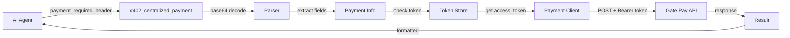

# 中心化支付工具

## 概述

中心化支付工具提供了一个 MCP tool (`x402_centralized_payment`)，用于解析 PAYMENT-REQUIRED header 并调用 Gate Pay 中心化支付接口完成支付。

## 功能特性

- 解析 base64 编码的 PAYMENT-REQUIRED header
- 自动提取支付信息（prepayId、orderId、currency、amount 等）
- 自动转换金额（从最小单位除以 10^6）
- 自动处理 Gate Pay OAuth 认证
- 调用 Gate Pay 中心化支付 API

## 使用方法

### 1. 环境变量配置（可选）

```bash
# 中心化支付 API 地址（可选，默认值如下）
GATE_PAY_CENTRALIZED_PAYMENT_URL=http://dev.halftrust.xyz/payment-service/payment/gatepay/v2/pay/ai/order/pay

# Client ID（可选，默认值：mZ96D37oKk-HrWJc）
GATE_PAY_CLIENT_ID=mZ96D37oKk-HrWJc

# Gate Pay OAuth 配置（认证必需）
GATE_PAY_OAUTH_CLIENT_SECRET=your_client_secret
GATE_PAY_OAUTH_TOKEN_BASE_URL=http://dev.halftrust.xyz
```

### 2. MCP Tool 调用

```typescript
// AI Agent 调用示例
{
  "name": "x402_centralized_payment",
  "arguments": {
    "payment_required_header": "eyJ4NDAyVmVyc2lvbiI6MiwiZXJy..." // base64 编码的 PAYMENT-REQUIRED header
  }
}
```

### 3. 输入格式

PAYMENT-REQUIRED header 应包含以下结构（base64 编码前）：

```json
{
  "x402Version": 2,
  "resource": {
    "orderId": "ORD-45B88F8B"
  },
  "accepts": [
    {
      "amount": "10000000",
      "extra": {
        "name": "USDC",
        "prepayId": "82967300620550384"
      }
    }
  ]
}
```

### 4. 输出格式

成功时返回：

```json
{
  "success": true,
  "message": "中心化支付成功",
  "paymentInfo": {
    "prepayId": "82967300620550384",
    "merchantTradeNo": "ORD-45B88F8B",
    "currency": "USDC",
    "amount": "10"
  },
  "response": { /* API 响应数据 */ }
}
```

失败时返回错误信息。

## 工作流程



## API 请求详情

### 请求 URL
默认：`http://dev.halftrust.xyz/payment-service/payment/gatepay/v2/pay/ai/order/pay`

### 请求方法
`POST`

### 请求头
```
Content-Type: application/json
X-GatePay-Access-Token: {access_token}
x-gatepay-clientid: mZ96D37oKk-HrWJc
```

### 请求体
```json
{
  "prepayId": "82967300620550384",
  "merchantTradeNo": "ORD-45B88F8B",
  "currency": "USDC",
  "totalFee": "10",
  "payCurrency": "USDC",
  "payAmount": "10",
  "uid": 10002
}
```

## 金额转换

金额自动从最小单位转换为主单位（除以 10^6）：

- 输入：`"10000000"` (字符串)
- 输出：`"10"` (10 USDC)

## 认证

工具会自动检查并刷新 Gate Pay access_token。如果 token 不可用，会触发 OAuth 流程（与 `x402_gate_pay_auth` 相同）。

## 测试

运行测试：

```bash
npm run test:centralized-payment
```

或手动运行：

```bash
npx tsx test/centralized-payment.test.ts
```

## 代码结构

```
src/gate-pay/centralized-payment/
├── parser.ts           # PAYMENT-REQUIRED header 解析
├── payment-client.ts   # Gate Pay API 客户端
└── index.ts           # 模块导出

src/tools/
└── centralized-payment.ts  # MCP tool handler

test/
└── centralized-payment.test.ts  # 单元测试
```

## 依赖关系

- 复用 `src/gate-pay/pay-token-store.ts` 进行 token 管理
- 复用 `src/gate-pay/auth.ts` 进行 OAuth 认证
- 遵循 `src/tools/` 中现有 tool 的模式和约定

## 故障排查

### Token 认证失败

如果收到"未能获取 access_token"错误：

1. 确保设置了 `GATE_PAY_OAUTH_CLIENT_SECRET` 环境变量
2. 运行 `x402_gate_pay_auth` 手动完成 OAuth 流程
3. 检查 `GATE_PAY_OAUTH_TOKEN_BASE_URL` 配置是否正确

### 解析失败

如果收到"解析 PAYMENT-REQUIRED header 失败"：

1. 确认 header 是正确的 base64 编码
2. 确认解码后是有效的 JSON
3. 确认包含必需字段（accepts、resource.orderId、extra.prepayId）

### API 调用失败

检查：

1. 网络连接是否正常
2. API URL 是否正确（环境变量 `GATE_PAY_CENTRALIZED_PAYMENT_URL`）
3. access_token 是否有效
4. 请求数据格式是否正确
